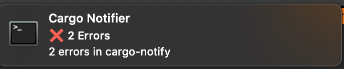

# cargo-notify

Cargo notify is a cargo plugin to run cargo build-like commands(`check`, `build`) and notify users of build completion and number of errors found (if any) through desktop notifications. Pairs nicely with [carg-watch](https://github.com/passcod/cargo-watch).

# Screenshots



# Installation
```bash
cargo install --git https://github.com/nikhilmitrax/cargo-notify
```

# But why?
The usual development workflow to notice errors in builds is to run (RLS/rust-analyzer) in the IDE, and potentially use [carg-watch](https://github.com/passcod/cargo-watch) to run check/build on file change. This works fairly well for small or medium sized projects, but can get a bit cumbersome for larger projects, where the compile time may be longer than a few seconds, at which point, getting a notification is useful.

# Interface
`cargo notify <cmd>`.

For example
```bash
cargo notify check
cargo watch -c -x 'notify check'
```

# Credits
A big thanks to [oli-obk](https://github.com/oli-obk) for the fantastic [cargo_metadata](https://github.com/oli-obk/cargo_metadata) which is used vendorized here.


# Contribution Ideas

Any contributions are welcome, but here are a few ideas I hope someone would explore.

- Remove vendorized `cargo_metadata` and use the crate directly: The last time I tried using it, there were some problems, and I decided to vendorize it to get going, but may be we should directly use the crate, and create issues in cargo_metadata's repo if it isn't usable as is.

- Cross Platform Support: Currently tested and found working on MacOS, but the underlying notification crate [notify-rust](https://crates.io/crates/notify-rust) supports BSD and Linux as well, just that it's untested there.

- Support for richer notifications: It currently notifies just the number of errors during compilation. It could potentially support more things.
